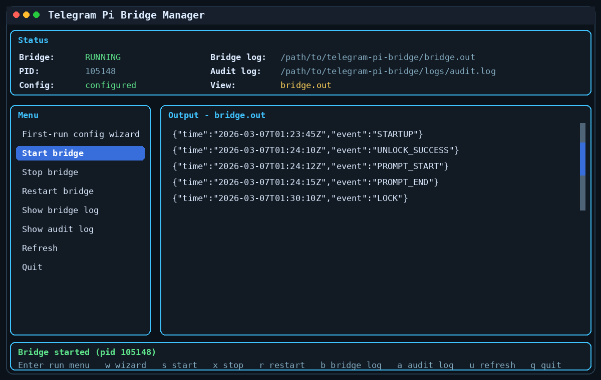
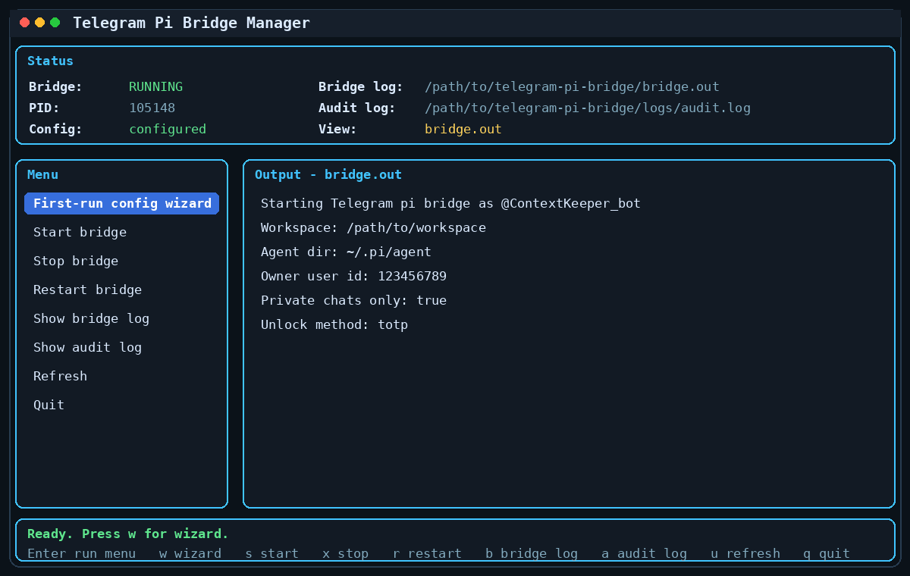

# Telegram Pi Bridge

A small, opinionated, slightly paranoid bridge between Telegram and [pi](https://github.com/badlogic/pi-mono).

License: [MIT](./LICENSE)

This project is intentionally **lightweight and specialized**:

- **pi** is the agent
- **this repo** is the bridge
- that's basically the whole trick

No giant platform. No orchestration circus. No "AI operating system for synergy-driven workflows." Just a Telegram bot wired into pi, with a few locks on the door.

## What this project is

This is a **single-owner remote admin bridge** for talking to pi through Telegram.

It was built for my own use first, then shared in case it is useful to someone else with similar needs.

Design goals:

- keep it simple
- keep it small
- keep pi as the real brain
- add just enough safety to not instantly regret exposing it to Telegram

## What this project is not

- not a general SaaS
- not a multi-user chat platform
- not a polished enterprise product
- not guaranteed to be a good idea

## Vibe-coded disclaimer

This project was **vibe coded**.

That means:

- it works for me
- it may work for you
- it may also decide to become a tiny goblin at the worst possible moment

There is **no warranty**, **no guarantee**, and **no promise of fitness for any purpose whatsoever**.
Use it **at your own risk**.

Seriously:

- review the code
- restrict the workspace
- rotate secrets if you leak them
- do not point this at anything you cannot afford to break

## Dependency: pi

This bridge depends on **pi** and uses the **pi SDK**.

- pi repo: https://github.com/badlogic/pi-mono
- npm package: https://www.npmjs.com/package/@mariozechner/pi-coding-agent

You need pi configured and authenticated separately.
This bridge does **not** replace pi. It simply gives pi a Telegram-shaped door.

For example, pi may be authenticated via:

- `pi /login`
- API keys stored in `~/.pi/agent`

If pi itself is not configured correctly, this bridge will not be able to answer.

## Features

- Telegram bot connection
- pi-powered responses via the pi SDK
- persistent pi session history per Telegram chat
- locked by default
- owner-only by Telegram user ID
- private-chat-only by default
- temporary unlock with **TOTP** or shared secret
- auto-lock after a configurable timeout
- audit logging
- optional owner alerts on denied attempts
- built-in TUI manager
- first-run configuration wizard
- CLI manager commands

## TUI preview

<p align="center">
  
</p>

<p align="center">
  
</p>

## Security model

This version is designed for **one owner only** and for **remote admin-style access**.

It is:

- locked by default
- owner-only by Telegram user ID
- private-chat-only by default
- unlockable with **TOTP** or a shared secret
- auto-locking after a configurable timeout
- able to alert you on unauthorized attempts
- able to keep an audit log

In other words: simple, but trying not to be reckless.

## Project layout

- `src/index.mjs` — main bridge process
- `src/manage.mjs` — CLI manager
- `src/tui.mjs` — terminal UI manager
- `.env.example` — configuration template
- `bridge.out` — main runtime output log
- `logs/audit.log` — JSON-lines audit log
- `data/sessions/<chat-id>/...` — persistent pi session history

## Installation

### 1. Clone the repo

```bash
git clone https://github.com/yourname/telegram-pi-bridge.git
cd telegram-pi-bridge
```

### 2. Install dependencies

```bash
npm install
```

### 3. Create your config

```bash
cp .env.example .env
```

Then edit `.env`.

At minimum you need:

```env
TELEGRAM_BOT_TOKEN=your_bot_token
OWNER_TELEGRAM_USER_ID=your_numeric_telegram_user_id
UNLOCK_METHOD=totp
UNLOCK_TOTP_SECRET=your_base32_secret
```

### 4. Make sure pi is installed and authenticated

You need pi available on the machine and configured already.

See:

- https://github.com/badlogic/pi-mono

## Configuration notes

### Recommended: TOTP unlock

```env
UNLOCK_METHOD=totp
UNLOCK_TOTP_SECRET=JBSWY3DPEHPK3PXP
```

Use your own base32 secret and load it into an authenticator app.
Do **not** use the example secret in production unless you enjoy chaos.

### Alternative: shared secret unlock

```env
UNLOCK_METHOD=secret
UNLOCK_SHARED_SECRET=replace_with_a_long_random_secret
```

### Important config values

- `OWNER_TELEGRAM_USER_ID` — only this Telegram user is allowed
- `OWNER_CHAT_ID` — optional extra lock to one specific chat
- `ALLOW_PRIVATE_CHATS_ONLY` — reject groups/supergroups/channels
- `UNLOCK_TTL_MINUTES` — auto-lock timeout
- `PI_WORKSPACE_DIR` — where pi will operate
- `PI_AGENT_DIR` — where pi config/auth lives
- `PI_MODEL_PROVIDER` / `PI_MODEL_NAME` — optional fixed model override
- `PI_THINKING_LEVEL` — optional thinking level override

## How to use

## Start the bridge normally

```bash
npm start
```

## Use the built-in TUI manager

```bash
npm run tui
```

From the TUI you can:

- run a first-run configuration wizard
- start the bridge
- stop the bridge
- restart the bridge
- see current status and PID
- view `bridge.out`
- view `logs/audit.log`

Useful keys:

- `w` — first-run wizard
- `s` — start
- `x` — stop
- `r` — restart
- `b` — bridge log
- `a` — audit log
- `u` — refresh
- `q` — quit

## Use the CLI manager

```bash
npm run bridge:status
npm run bridge:start
npm run bridge:stop
npm run bridge:restart
npm run bridge:logs
npm run bridge:audit
```

## Use it from Telegram

Commands:

- `/status` — show whether the bot is locked
- `/unlock <code>` — unlock agent access temporarily
- `/lock` — lock immediately
- `/clear` — clear the current pi session, only when unlocked

Normal text prompts are forwarded to pi **only while unlocked**.

## How locking works

- the bot starts **locked**
- while locked, free-text prompts are refused
- `/unlock <code>` unlocks it for `UNLOCK_TTL_MINUTES`
- after the timeout, it auto-locks again

So yes, it is basically a remote control for pi with a dead-man switch.
Or at least a mildly anxious-man switch.

## Alerts and audit log

If `ALERT_OWNER_ON_DENIED=true`, denied attempts generate a Telegram alert to the owner chat.

Audit events are appended as JSON lines to:

- `AUDIT_LOG_FILE`

Typical events include:

- `DENIED_USER`
- `DENIED_CHAT_TYPE`
- `UNLOCK_SUCCESS`
- `UNLOCK_FAILURE`
- `PROMPT_START`
- `PROMPT_END`
- `PROMPT_ERROR`

## Security notes

Please do not treat "it has a lock" as equivalent to "it is safe."

Recommended precautions:

- enable Telegram 2FA on your account
- keep the bot token secret
- restrict permissions on `.env`, `logs/`, `data/`, and `~/.pi/agent`
- narrow `PI_WORKSPACE_DIR` as much as possible
- set `OWNER_CHAT_ID` if you want to pin access to one specific chat
- rotate secrets if they ever appear in chat history, shell history, screenshots, or the internet being the internet

## systemd example

The repo includes a generic service template at:

- `systemd/telegram-pi-bridge.service.example`

Your own machine-specific local service file should live at:

- `systemd/telegram-pi-bridge.service`

That local file is gitignored on purpose.

The first-run TUI wizard can generate that local service file for your machine.

If you want to install it system-wide, copy the generated or template file to:

- `/etc/systemd/system/telegram-pi-bridge.service`

Example:

```ini
[Unit]
Description=Telegram Pi Bridge
After=network-online.target
Wants=network-online.target

[Service]
Type=simple
User=youruser
WorkingDirectory=/opt/telegram-pi-bridge
EnvironmentFile=/opt/telegram-pi-bridge/.env
ExecStart=/usr/bin/npm start
Restart=always
RestartSec=5
NoNewPrivileges=true
PrivateTmp=true
ProtectControlGroups=true
ProtectKernelTunables=true
ProtectKernelModules=true
LockPersonality=true
RestrictSUIDSGID=true
UMask=0077

[Install]
WantedBy=multi-user.target
```

Then:

```bash
sudo systemctl daemon-reload
sudo systemctl enable --now telegram-pi-bridge
sudo systemctl status telegram-pi-bridge
```

## Final warning, but with affection

This repo is small on purpose.
That is a feature.

If you want a big framework, this is not that.
If you want a compact Telegram-to-pi bridge with a few security rails and a manager TUI, that is exactly what this is.

Use it, fork it, improve it, or laugh at it.
But please do so responsibly.